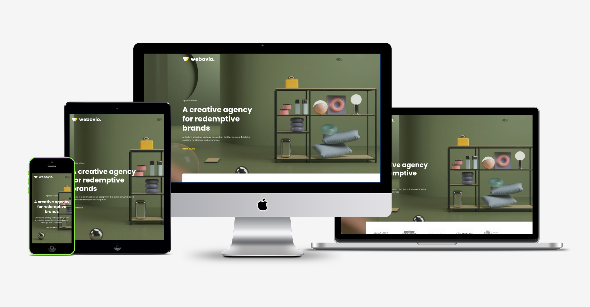
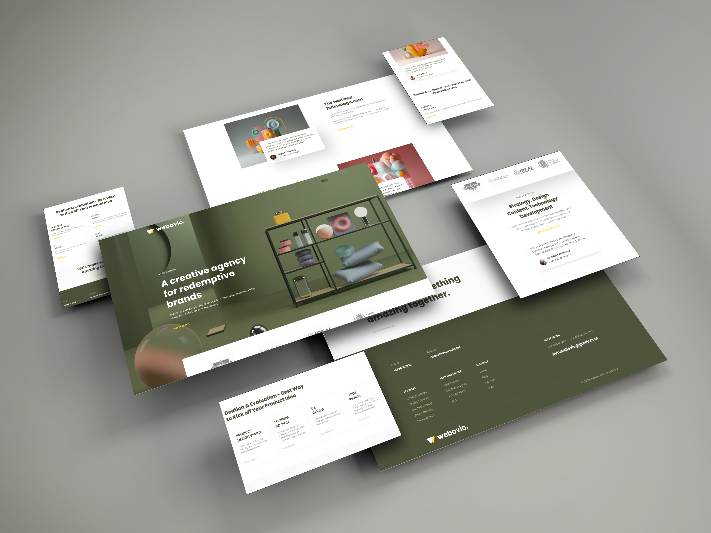
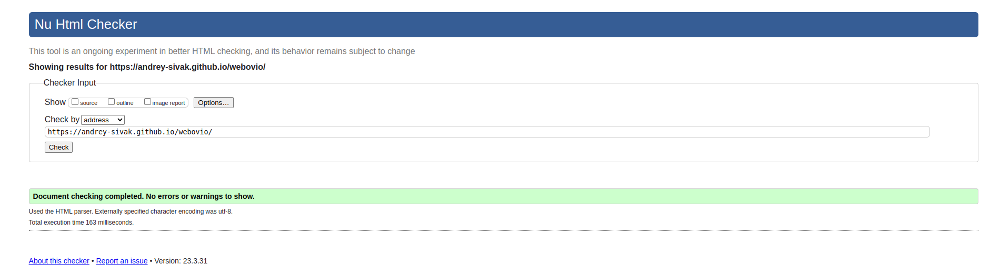
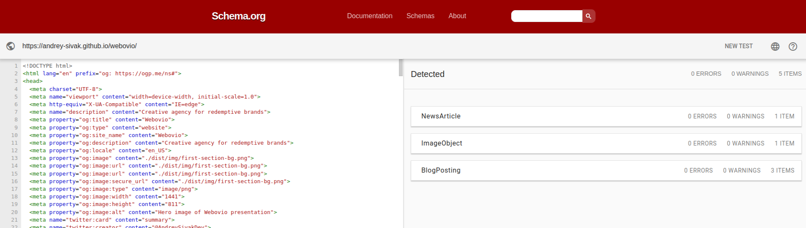
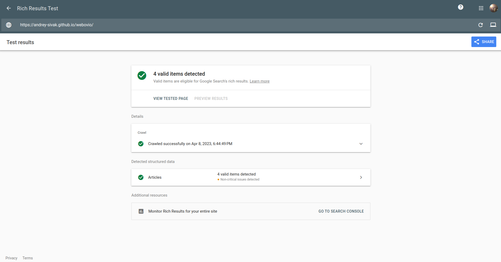
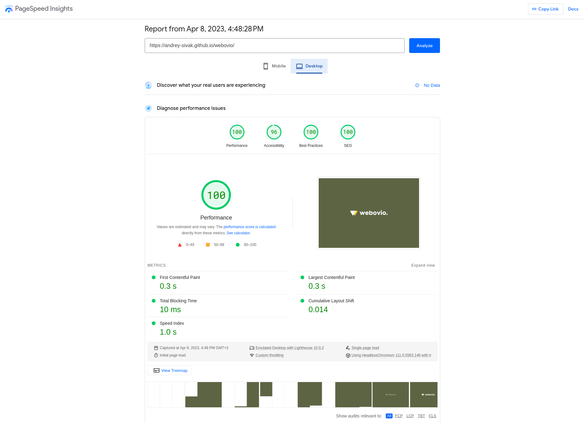
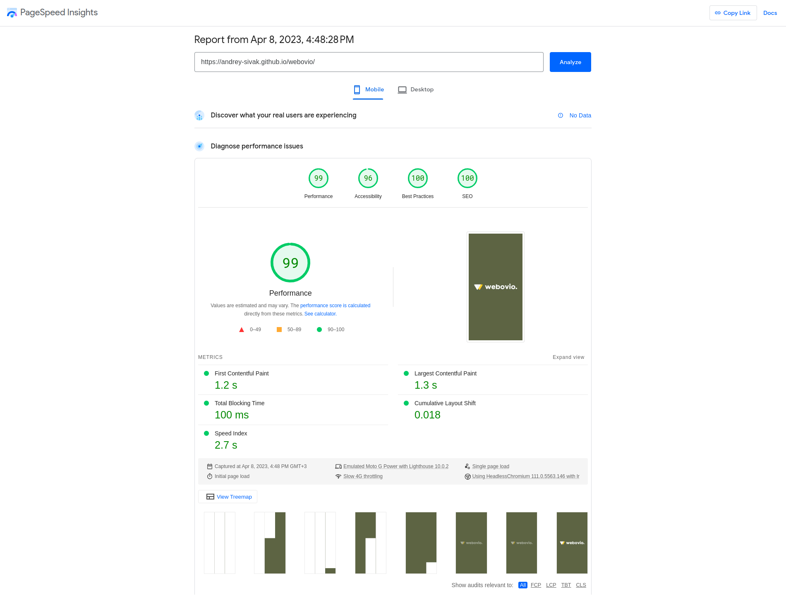

## Creative sample of the agency portfolio presentation
___
### Template of the agency portfolio presentation website.
The main feature of the project is a creative beautiful scrolling animation (GSAP). 
Also, worth to mention a dark theme mod and many useful features which are available in web development now. See below for more details  

✔️ **Fully responsive web design**



✔️ **Cross-browser compatibility**



✔️ **Valid, semantic HTML5 markup structure** verified by [w3c validator](https://validator.w3.org/)



✔️ **Basic SEO optimization included opengraph meta tags and microdata** verified by [Schema.org](https://validator.schema.org/) and [Google validator](https://search.google.com/test/rich-results)

 


✔️ **Optimized by [Google PageSpeed Insights](https://pagespeed.web.dev/) requirements (see attached screens below)**
  - optimized web fonts
  - **`High`** optimized images for support webp format, different screens and devices and pretty svg-preloader if image will not load
  - minified styles using cssnano
  - optimized JS using Webpack




✔️ **Clear, readable, maintainable and editable code**

## Tools Used
- `Gulp` for assets management
    - Optimize images and generate webp-images
    - Create `SVG` sprites
    - Local dev server with hot reload
    - Convert `.ttf|.otf` fonts to `.woff|.woff2`
- `Webpack` & `Babel` for JavaScript
- `PostCSS` using `Tailwind` & `SCSS` for clear and optimize css
- `ESLint` & `Prettier` for code styling
- `git-commit-msg-linter` for clear commit messages
- `validate-branch-name` for branch naming
- `Husky` for git hooks:
    - pre-commit - `$ npx validate-branch-name && npm run lint:fix`
    - commit-msg - `$ npx commitlint --edit $1`
    - pre-push - `$ npm run lint`
___

## Structure
```
├── .husky 
│   ├── _
│   ├── commit-msg
│   ├── pre-commit
│   ├── pre-push
├── dist (or build)
│   ├── css
│   │   ├── *.min.css
│   ├── img
│   │   ├── *{.png,.jpg,.jpeg,.gif}
│   ├── js
│   │   ├── *.min.js
│   ├── fonts
│   │   ├── *.{.woff,.woff2}
├── gulp (gulp settings)
│   ├── config
│   │   ├── path.js (project path definitions)
│   │   ├── plugins.js (gulp plugin)
│   ├── tasks (all of gulp tasks)
│   │   ├── { task }.js
├── node_modules
├── src (assets directory)
│   ├── scss
│   │   ├── **/*.scss
│   ├── img
│   │   ├── *{.png,.jpg,.jpeg,.gif}
│   ├── js
│   │   ├── **/*.js
│   ├── fonts
│   │   ├── *.{.woff,.woff2,.ttf,.otf}
├── .babelrc
├── .commitlintrc.json
├── .eslintignore
├── .eslintrc
├── .gitignore
├── .prettierignore
├── .prettierrc
├── commitlint.config.js
├── gulpfile.js (common bundle file)
├── index.html (common html)
├── package.json
├── package-lock.json
├── README.md
└── tailwind.config.cjs
```
---


